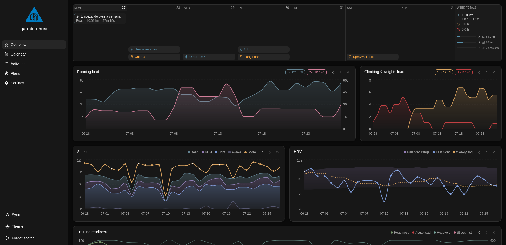

# garmin-nhost

A personal training dashboard: Garmin activities synced into Nhost (Postgres +
Hasura), annotated and planned through a React dashboard.





## Layout

| Path                | What it is                                              |
| ------------------- | ------------------------------------------------------- |
| `dashboard/`        | React + Vite SPA, deployed as an Nhost Run service       |
| `sync/`             | Garmin -> Postgres CLI (`make sync`, `make backfill`)    |
| `nhost/migrations/` | Postgres migrations (`nhost.toml` is the project config) |
| `nhost/metadata/`   | Hasura table metadata and permissions                    |
| `flake.nix`         | Dev shell pinning the Nhost CLI, Node and Docker client  |

Sync is a local CLI (`sync/`), run by hand via `make`. It previously ran as an
Nhost Run service (`ondra`) that Hasura called through a remote schema; Garmin
rate-limits made that unworkable.

## Getting started

Everything runs inside the Nix dev shell:

```sh
nix develop            # nhost-cli, node 22, docker client
nhost up               # local Postgres + Hasura + Auth on local.*.nhost.run
cd dashboard && npm ci && npm run dev
```

`nhost up` needs ports 443/80 free — it fails with `port is already allocated`
if another local stack is bound to them.

Copy `.env.example` → `.env` and `.secrets.example` → `.secrets` at the repo
root, and `dashboard/.env.example` → `dashboard/.env`.

### Dashboard commands

```sh
npm run dev         # vite dev server
npm run typecheck   # tsc -b
npm test            # vitest
npm run build       # tsc -b && vite build
npm run codegen     # regenerate src/graphql/generated.ts from the live schema
```

`codegen` introspects a running Hasura, so `nhost up` must be running:

```sh
HASURA_GRAPHQL_ENDPOINT=https://local.graphql.local.nhost.run/v1 \
HASURA_GRAPHQL_ADMIN_SECRET=<from .secrets> \
NODE_TLS_REJECT_UNAUTHORIZED=0 npm run codegen
```

`generated.ts` is committed; `npm run codegen:check` fails if it drifts from
`operations.graphql`.

### Deploying

Pushing to `main` with changes under `dashboard/**` builds a multi-arch image to
GHCR and runs `nhost run config-deploy` (`.github/workflows/dashboard.yml`).
Schema changes are **not** deployed by CI — apply those yourself:

```sh
nhost config apply --subdomain <subdomain>   # nhost.toml
# migrations + metadata: via the Nhost dashboard or CLI
```

## Data model

### Synced from Garmin

Written by the sync, read-only in the dashboard.

- **`activities`** — one row per Garmin activity, keyed by `garmin_activity_id`.
  Mixes synced columns with user-owned annotation columns (see below).
- **`activity_samples`** — full-resolution stream, one row per FIT record.
  See [Samples](#samples).
- **`activity_streams`** — the older jsonb payload of independently downsampled
  HR / elevation / GPS series. Still what the dashboard reads; superseded by
  `activity_samples` and dropped once the backfill is verified.
- **`sleep`**, **`daily_hrv`**, **`training_readiness`** — one row per
  `calendar_date`.

### User-owned

- **`activities`** annotation columns — `name`, `subtype`, `feeling`, `effort`,
  `food_during`, `food_after`, `caffeine`, `weather`, `notes`, `focus`,
  `hard_tries`, `strength_exercises`. **The sync must never overwrite these.**
- **`day_plans`** — a dated free-text intention, optional `sport`.
- **`week_objectives`** — a measurable weekly target (`metric` ∈ distance,
  elevation, duration, sessions) diffed against real activity totals.
- **`week_notes`** — one note per ISO week, `week` is the primary key.
- **`sports`** — lookup table backing the `sport` foreign keys. Adding a sport
  is an `INSERT`, not a migration.
- **`races`**, **`exercises`**, **`food_options`** (a view).

ISO weeks are stored as `'2026-W03'` text, CHECK-constrained. They sort
lexicographically in chronological order, which the calendar relies on.

## Sync

`sync/` is a small CLI. It talks to Postgres directly rather than through
Hasura — sample volume makes `COPY` the only sensible transport, and it runs
locally as a trusted tool. Configure it with the `sync` block in `.env`.

```sh
make sync                      # recent activities + sleep/HRV/readiness
make sync ARGS="--limit 50"    # look further back
make sync-activities           # activities only
make test                      # unit tests
```

First run needs `GARMIN_EMAIL` / `GARMIN_PASSWORD` to create the garth token
cache in `GARTH_DIR`. After that the tokens refresh silently and the
credentials can be removed.

Each activity is committed on its own, so a run that is interrupted or
rate-limited keeps everything it already finished. `REQUEST_DELAY_S` throttles
the pause between Garmin requests.

### The annotation rule

`activities` mixes synced columns with user-authored ones (`name`, `feeling`,
`effort`, `notes`, `focus`, ...). Those exist nowhere else — Garmin has never
seen them — so overwriting them is unrecoverable.

Upserts therefore list only `db.ACTIVITY_SYNCED_COLUMNS` in `DO UPDATE`.
`name` and `subtype` are seeded on first insert and never updated again.
`test_upserts_never_overwrite_user_columns` guards this; if you add an
annotation column, add it to `ANNOTATION_COLUMNS` in the test too.

### Samples

`activity_samples` is a TimescaleDB hypertable holding one row per FIT record —
nothing is downsampled, and every channel shares a timestamp:

| column        | notes                                       |
| ------------- | ------------------------------------------- |
| `recorded_at` | hypertable time dimension                   |
| `elapsed_s`   | seconds since the activity's first record   |
| `hr`          | bpm                                         |
| `altitude_m`  | metres                                      |
| `distance_m`  | **cumulative** metres, straight from the FIT |
| `geom`        | PostGIS `Point(4326)`, null when indoors     |

Because distance and altitude now share a row, elevation can be plotted against
*distance* rather than time, which is what stops profiles stretching on climbs.

Time in an arbitrary HR range is a plain query — no zone table, because the
bands are whatever you ask for at query time:

```sql
SELECT sum(delta) FROM (
  SELECT recorded_at - lag(recorded_at) OVER (ORDER BY recorded_at) AS delta, hr
  FROM activity_samples WHERE activity_id = $1
) s WHERE hr BETWEEN 150 AND 160;
```

### Gradient views

`activity_sample_grades` adds a `grade_pct` per sample, measured across a
15-sample lookback — raw point-to-point gradient is meaningless because GPS
altitude jitters by metres between consecutive seconds.

`grade_band(grade_pct)` classifies that into a signed band: `0` flat, `1..5`
uphill, `-1..-5` down, at 3/8/15/25/35%. `activity_grade_segments` collapses
contiguous runs of one band into segments with their own `ST_MakeLine`
geometry — the "this part was uphill 3" markers — dropping anything under 50 m
so band flapping around a threshold does not produce slivers.

All of this is derived on read. Retuning a threshold is an edit to
`grade_band`, never a re-sync.

### Backfill (delete when done)

`backfill` fetches full-resolution samples for GPS activities recorded before
`activity_samples` existed.

```sh
make backfill-dry                 # list candidates, fetch nothing
make backfill                     # run it
make backfill ARGS="--limit 25"   # a bounded first pass
```

It is deliberately narrow: candidates come from the database
(`start_lat IS NOT NULL AND samples_synced_at IS NULL`, so no Garmin requests
to plan), it writes only `activity_samples`, and the one column it touches on
`activities` is `samples_synced_at`. It never writes summaries or annotations.
Re-running is safe — each activity's samples are replaced wholesale, and
finished activities are skipped.

Expect it to take several sessions and to hit rate limits. Rerun it; it resumes.

**Once verified**, three cleanups remain, in order: point the dashboard at
`activity_samples`, drop `activity_streams` and its jsonb payload, then delete
the `backfill` command. Until then `activity_streams` is still the only thing
the dashboard reads, and nothing reads `activity_samples`.

## Notes

- **Auth** is passwordless email OTP with signup disabled; users are provisioned
  manually. Local OTP mail needs templates in `nhost/emails/<locale>/` — Auth
  returns a 500 (`template not found`) if the directory is empty.
- **Map tiles** come from Stadia Maps (`lib/map-tiles.ts`). Stadia serves
  `localhost` unauthenticated but returns 401 tiles elsewhere, so allowlist the
  deployed domain on the Stadia account or set `VITE_STADIA_API_KEY`. CARTO is
  deliberately unused: it now stamps "API KEY REQUIRED" onto keyless tiles while
  still returning HTTP 200, so the failure is silent.
- **The 3D terrain view** needs `VITE_MAPTILER_KEY`; it renders a message when
  absent.
